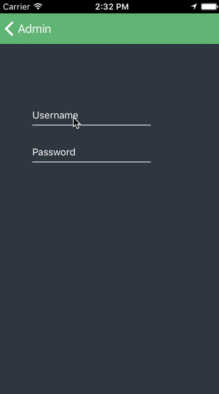
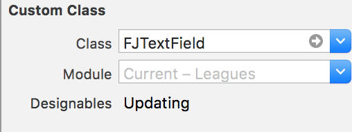
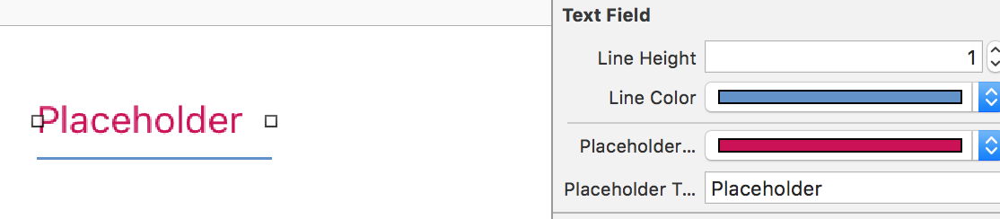

# iOS-FJTextField

[](https://developer.apple.com/iphone/index.action)
[](https://developer.apple.com/swift)

Easy to use material design text field for iOS. Swift 3.



## Instalation

Just add the ```FJTextField.swift``` file to your project.

## Usage

### Storyboard

Drag a ```UITextField``` on your storyboard and give it a ```FJTextField``` class.



Now you can change all of the properties and see the effect in real time in your interface builder.



### Code
```swift
    let tx:FJTextField = FJTextField(frame: CGRect(x: 100, y: 100, width: 200, height: 30))
        
    self.view.addSubview(tx)
        
    tx.placeholderText = "Name"
        
    tx.placeholderColor = UIColor.blue
        
    tx.lineColor = UIColor.blue
        
    tx.placeholderFont = UIFont(name: "Lato-Regular", size: 15);
```
## Improvements

Add error messages.

## Contributing

Forks, patches and other feedback are welcome.

## Creators

[Ivan Ferenčak](https://github.com/iferencak)

[Josip Jurić](https://github.com/joco92)
